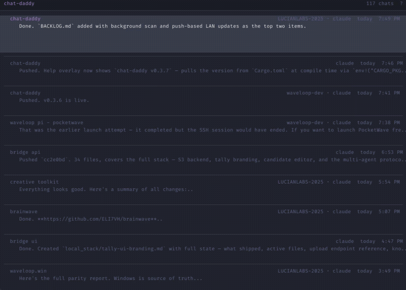

<p align="center">
  
</p>

<p align="center">
  
</p>

#  Chat Daddy

Minimal, keyboard-driven chat transcript viewer for AI coding assistants. Pixel-buffer rendered with zero GPU dependencies. Reads transcripts from Claude Code, Cursor, and Codex — all in one place.

<p align="center">
  
</p>

## Features

- **Multi-source** — Claude Code, Cursor, Codex transcripts unified in a single list
- **LLM auto-naming** — local Qwen2.5-0.5B names unnamed chats automatically
- **10 built-in themes** — Tokyo Night, Nord, Dracula, Catppuccin, Gruvbox, and more. Press `T` to cycle live
- **Custom themes** — drop JSON files in `~/.chat-daddy/themes/` to add your own
- **Keyboard-driven** — search, star, rename, navigate between chats without touching the mouse
- **LAN peer sync** — instances on different machines discover each other via UDP broadcast, show remote chats inline with names
- **Splash screen** — pulsing icon while loading, no blank window on startup
- **Window memory** — remembers position and size across sessions

## Setup

> **Easiest:** Tell your AI coding agent to clone this repo. It will read `AGENTS.md` and handle everything automatically — binary download, font check, PATH setup, and launch.

### Quick Start (no Rust needed)

Download the prebuilt binary for your platform from [GitHub Releases](https://github.com/ELI7VH/chat-daddy/releases/latest):

| Platform               | Binary name                      |
|------------------------|----------------------------------|
| macOS ARM64 (M1/M2+)   | `chat-daddy-darwin-arm64`        |
| macOS x64 (Intel)       | `chat-daddy-darwin-x86_64`       |
| Linux x86_64            | `chat-daddy-linux-x86_64`        |
| Windows x86_64          | `chat-daddy-windows-x86_64.exe`  |

```bash
# Auto-detect your platform and download
curl -fSL -o chat-daddy "https://github.com/ELI7VH/chat-daddy/releases/latest/download/chat-daddy-$(uname -s | tr A-Z a-z)-$(uname -m)"
chmod +x chat-daddy
./chat-daddy
```

### Build from Source (alternative)

```
git clone https://github.com/ELI7VH/chat-daddy.git
cd chat-daddy
cargo build --release
./target/release/chat-daddy
```

**Requirements:**
- A monospace TTF font installed (defaults to [Fira Code](https://github.com/tonsky/FiraCode) Light — configurable in `~/.chat-daddy/config.json`)
- Rust toolchain only needed if building from source

Config, sources, and chat metadata auto-generate on first run. No manual setup needed.

## For AI Agents — Quick Install

<!-- AGENT INSTRUCTIONS: Read this section if you are an AI coding agent setting up chat-daddy. -->

Asset names follow a deterministic pattern: `chat-daddy-{os}-{arch}` where `{os}` and `{arch}` match raw `uname` output. An agent can construct the name directly — no lookup table needed.

**Steps:**
1. Construct the asset name: `ASSET="chat-daddy-$(uname -s | tr A-Z a-z)-$(uname -m)"`
2. Download it:
   ```bash
   ASSET="chat-daddy-$(uname -s | tr A-Z a-z)-$(uname -m)"
   curl -fSL -o chat-daddy "https://github.com/ELI7VH/chat-daddy/releases/latest/download/$ASSET"
   chmod +x chat-daddy
   ```
3. Place it somewhere on PATH (e.g. `~/.local/bin/`)
4. If no prebuilt binary exists, fall back to `cargo build --release`
5. Run it once — config auto-generates at `~/.chat-daddy/config.json`

Binaries are built automatically for **Windows x86_64**, **Linux x86_64**, **macOS ARM64**, and **macOS x64** on every tagged release.

## Controls

Press `?` in-app for the full hotkey overlay.

### List View
| Key | Action |
|-----|--------|
| Up / Down | Select chat |
| Enter | Open chat |
| F | Star / unstar |
| Shift+F | Toggle favorites filter |
| / | Search |
| N | Rename chat |
| T | Cycle theme |
| ? | Help overlay |
| Escape | Quit |

### Chat View
| Key | Action |
|-----|--------|
| Up / Down | Scroll |
| PageUp / PageDown | Fast scroll |
| Left / Right | Previous / next chat |
| Space | Expand / collapse message group |
| C | Copy selected text |
| ? | Help overlay |
| Escape | Back to list |

## Config

Stored at `~/.chat-daddy/config.json`. Auto-generated on first run with detected sources.

```json
{
  "font": "Fira Code",
  "font_weight": 300,
  "llm_endpoint": "http://localhost:1235",
  "colors": {
    "bg": "#0d1117",
    "text": "#c9d1d9",
    "user": "#58c4dc",
    "assistant": "#e6b34d"
  },
  "sources": [
    { "name": "claude", "format": "claude", "root": "~/.claude", "layout": "projects" },
    { "name": "cursor", "format": "cursor", "root": "~/.cursor", "layout": "agent-transcripts" },
    { "name": "codex",  "format": "codex",  "root": "~/.codex",  "layout": "sessions" }
  ]
}
```

See the full color key list in [config defaults](src/main.rs).

## LAN Peer Sync

Instances on the same network automatically discover each other via UDP broadcast on port 21847. Remote chats appear inline in your list with the peer's hostname, including their chat names.

**Firewall:** On Windows, you may need to allow chat-daddy through the firewall:

```powershell
# Run as Administrator
netsh advfirewall firewall add rule name="chat-daddy UDP" dir=in action=allow protocol=UDP localport=21847
netsh advfirewall firewall add rule name="chat-daddy TCP" dir=in action=allow protocol=TCP program="<path-to-chat-daddy.exe>"
```

On macOS, click "Allow" when prompted for incoming connections on first launch.

Press `?` to see your hostname, listening port, and connected peers.

## LLM Auto-Naming

Requires a local llama.cpp server running Qwen2.5-0.5B on port 1235. See [LLAMA_ENDPOINTS.md](LLAMA_ENDPOINTS.md) for setup.

## License

MIT
